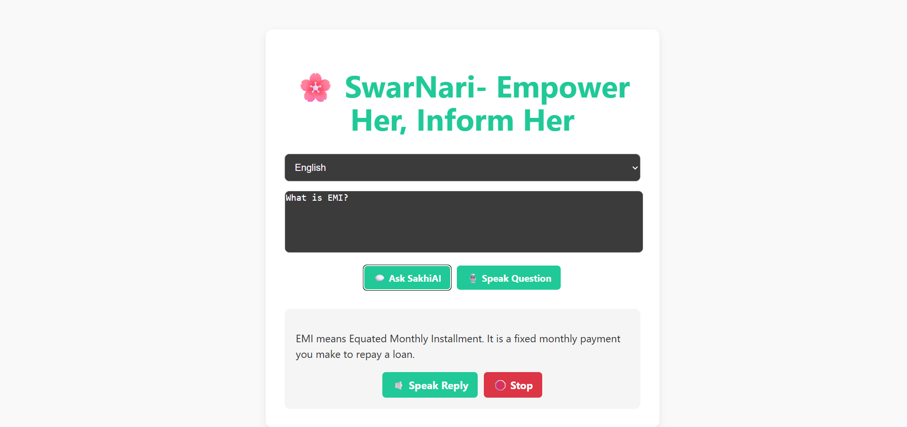

# 🌸 SwarNari – Voice-Based Financial Assistant for Women

**SwarNari** is a multilingual, voice-based AI chatbot designed to provide financial literacy support to rural and underserved women in India. Built with a voice-first approach, SwarNari allows users to ask financial questions in their native language and get simple, spoken answers — just like chatting with a helpful friend.

---

## 🔧 Tech Stack

- **Frontend**: HTML, CSS, JavaScript, React
- **Voice Input**: Web Speech API (SpeechRecognition)
- **Voice Output**: SpeechSynthesis API
- **NLP Backend**: Dialogflow
- **Languages Supported**: Hindi (`hi-IN`), Gujarati (`gu-IN`), English (`en-IN`)
- **APIs Used**: Bhashini (planned), Google Translate API (optional)

---

## 💡 Key Features

- 🎙️ **Voice-based input** – No typing needed
- 🔊 **Voice-based output** – Easy-to-understand audio replies
- 🌐 **Multilingual** – Works in Hindi, Gujarati, and English
- 🤝 **Simple UI** – Accessible for women with low digital literacy
- 🔐 **Privacy-first** – No user data stored

---

## 🛠 Current Limitations

- Hindi and Gujarati support under improvement
- Works best in **Chrome desktop browser** for voice features
- Requires active internet connection

---

## 📷 Screenshots

---

## 🧠 Example Use Cases

- What is a savings account?
- How to apply for a government loan?
- How to avoid online banking fraud?

---

## 🚀 Future Plans

- Expand language support across Indian languages
- Add integration with IVR systems for feature phones
- Include voice training for accents and dialects
- Partner with NGOs for real-world deployment

---

## 👩‍💻 My Role

This project was built as part of the **WWT All India Women-Only Hackathon 2025**.

**In my team, I was responsible for:**
- Frontend development
- Voice input/output integration
- Dialogflow agent configuration and training

---
## 📜 Certificate

[WWT Hackathon Participation Certificate](WWT-CERTIFICATE.jpg)

---

## 📩 Contact

💬 Have feedback or ideas?  
Reach out on [LinkedIn](https://www.linkedin.com/in/devayani-nakarani) or create an issue in this repo!

---

## 🏷️ Tags

`#AIForGood` `#VoiceAssistant` `#WomenEmpowerment` `#FinancialLiteracy` `#HackathonProject` `#Dialogflow` `#React`

---

## 📄 License

MIT License © 2025 [Devayani Nakarani](https://github.com/DevayaniNakarani)

